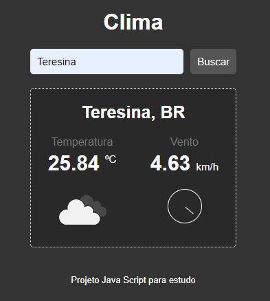

# Projeto-Clima
<h2>Conhecimentos obtidos com o projeto</h2>
<ul> 
    <li>Manipulação de API</li>
    <li>Requisição interna</li>
    <li>Montagem de JSON</li>
    <li>Manipulação de Objetos</li>
    <li>Manipulação do DOM</li>
</ul>

 Busca informações de clima de cidades, estados e paises.
  
